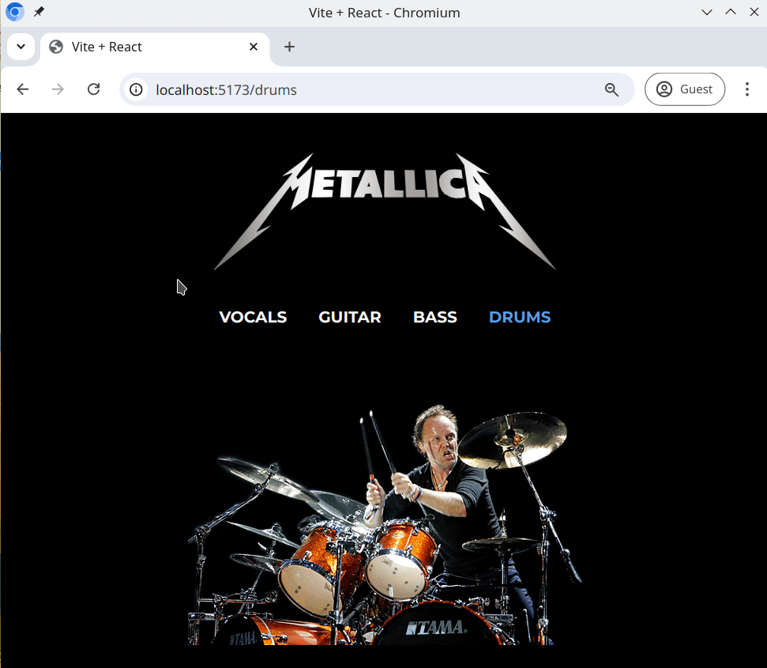

# Band landing page

This exercise will help you further practice React Router v6, by completing this small React app for your favorite band.

## Task

Build a website like in the example below (it doesn't have to be the same, you can base it on your own favourite band!).

- Implement a navigation menu. It must have at least four links (e.g, vocals, bass, guitar, and drums)
- When a user clicks on a navigation item, the app should navigate to the new path
- Use the [react-router-dom](https://www.npmjs.com/package/react-router-dom) package to handle routing and navigation
- It's not required to implement transitions between pages
- Display an image or text, or a combination of the two for each page in the navigation

## Example

## Bonus Task

You can experiment with transitions between pages as well. Here are some interesting libraries:

- https://reactcommunity.org/react-transition-group/
- https://www.framer.com/motion/
