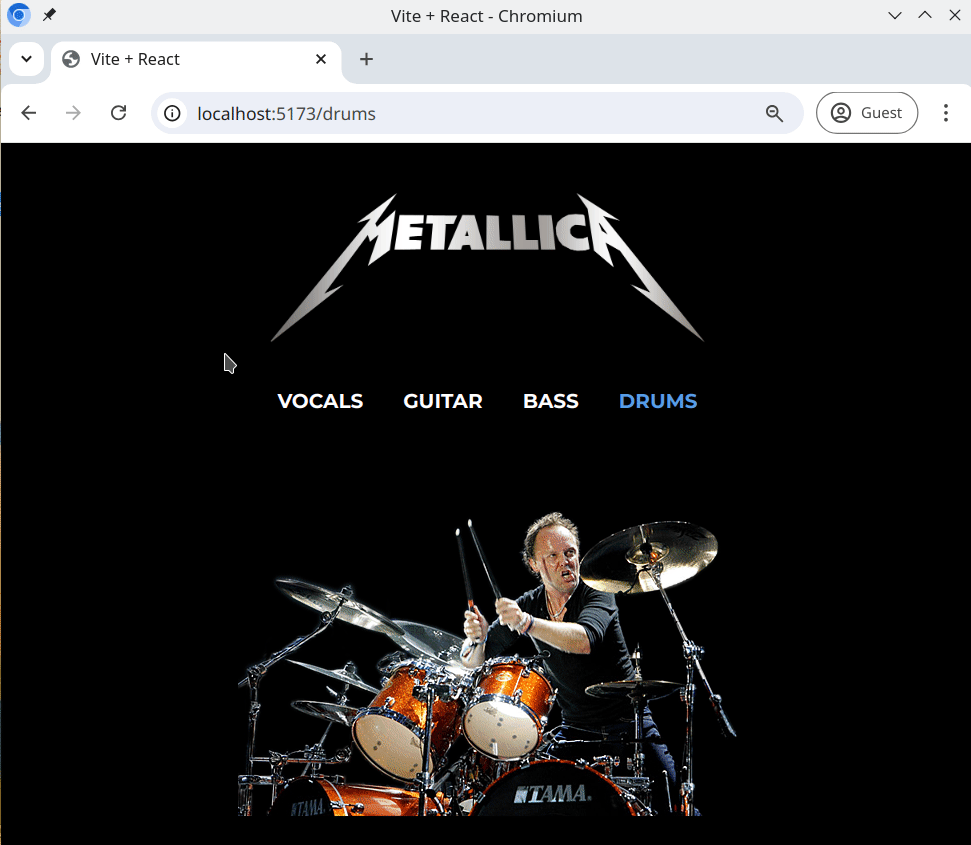

# Band-Landing-Page

Diese Übung wird dir helfen, deine Fähigkeiten mit React Router v6 weiter zu verbessern, indem du diese kleine React-App für deine Lieblingsband vervollständigst.

## Aufgabe

Erstelle eine Webseite wie im Beispiel unten (sie muss nicht gleich sein, du kannst sie auf deine eigene Lieblingsband basieren!).

- Implementiere ein Navigationsmenü. Es muss mindestens vier Links haben (z.B. Gesang, Bass, Gitarre und Schlagzeug).
- Wenn ein Benutzer auf ein Navigations-Element klickt, sollte die App zum neuen Pfad navigieren.
- Verwende das [react-router-dom](https://www.npmjs.com/package/react-router-dom) Paket, um das Routing und die Navigation zu handhaben.
- Es ist nicht erforderlich, Übergänge zwischen den Seiten zu implementieren.
- Zeige ein Bild oder Text, oder eine Kombination aus beidem für jede Seite in der Navigation an.

## Beispiel

## Bonusaufgabe

Du kannst auch mit Übergängen zwischen den Seiten experimentieren. Hier sind einige interessante Bibliotheken:

- https://reactcommunity.org/react-transition-group/
- https://www.framer.com/motion/
